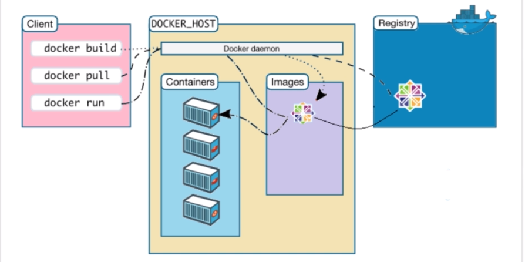
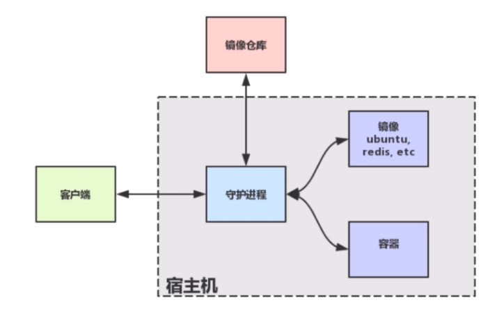

# docker介绍

可以粗糙的理解为轻量级的虚拟机.

Docker 的核心组件包括：

    1. Docker 客户端 - Client
    2. Docker 服务器 - Docker daemon
    3. Docker 镜像 - Image
    4. Docker 仓库 - Registry
    5. Docker 容器 - Container
架构图如下

 

 Docker 采用的是 Client/Server 架构。客户端向服务器发送请求，服务器负责构建、运行和分发容器。客户端和服务器可以运行在同一个 Host 上，客户端也可以通过 socket 或 REST API 与远程的服务器通信.将上图总结为下图
  

## 1. Volumn
提供独立于容器之外的持久化存储

 [下一篇 docker基本命令](./02.md)
    