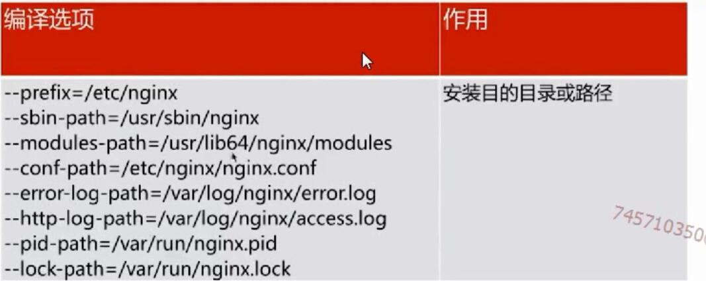

# nginx介绍
Nginx是一个开源且高性能,可靠的HTTP中间件,代理服务器.
其他的HTTP服务
1. HTTPD-Apache基金会
2. IIS-微软
3. GWS-Google
# 选择nginx的原因
1. IO多路复用epoll(多个描述符的I/O操作都能在一个线程内并发交替地顺序完成.这里的复用指的是复用同一个线程)
2. 轻量级(功能模块少,代码模块化)
3. cpu亲和(affinity)(把cpu的核心和nginx的工作进程绑定,把每个worker进程固定到一个CPU上执行,减少切换CPU的cache miss,获得更好的性能)
4. sendfile(零拷贝的文件传输,在内核层传输,不需要经过多层)

# nginx 安装目录

[下一篇](02.md)